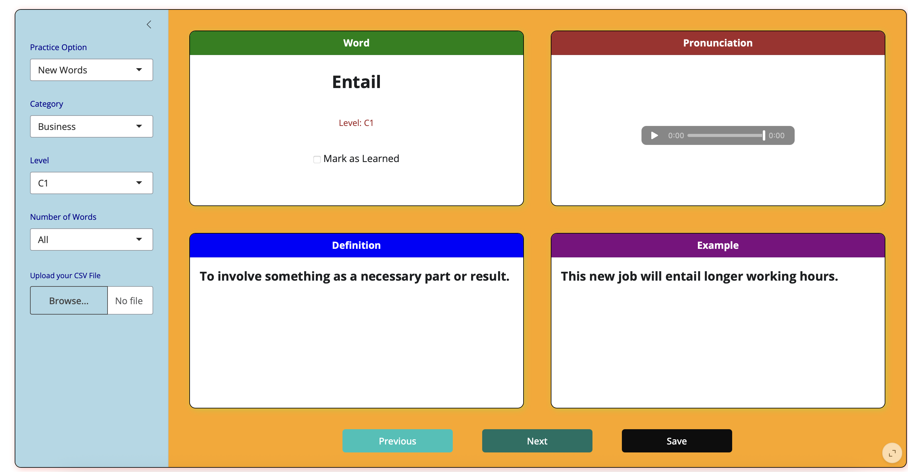

### 🧠 English Toolkit – Interactive Vocabulary Learning App

**English Toolkit** is an interactive web application designed to help users expand and reinforce their English vocabulary through an engaging, structured interface. The app allows learners to practice new words, review previously learned vocabulary, and explore words across different categories and difficulty levels (A1–C2).

Users can choose between multiple learning modes — *New Words*, *Review*, or *All Words* — and filter their study list by category (e.g., Business, Social, Health) and CEFR level. They can also specify the number of words to review in each session or upload their own CSV file to personalize the vocabulary set.

Each session displays a word along with its **definition** and **example usage**, while a built-in **pronunciation feature** generates and plays the corresponding English audio automatically. Learners can **mark words as learned**, and their progress is stored persistently so they can continue from where they left off in future sessions.

The interface includes clean visual cards with color-coded headers for each section — *Word*, *Pronunciation*, *Definition*, and *Example* — along with intuitive “Next”, “Previous”, and “Save” buttons for navigation and progress management.

The overall goal is to make vocabulary learning more interactive, memorable, and visually organized, combining **language practice, audio feedback, and progress tracking** into one lightweight and user-friendly dashboard.
